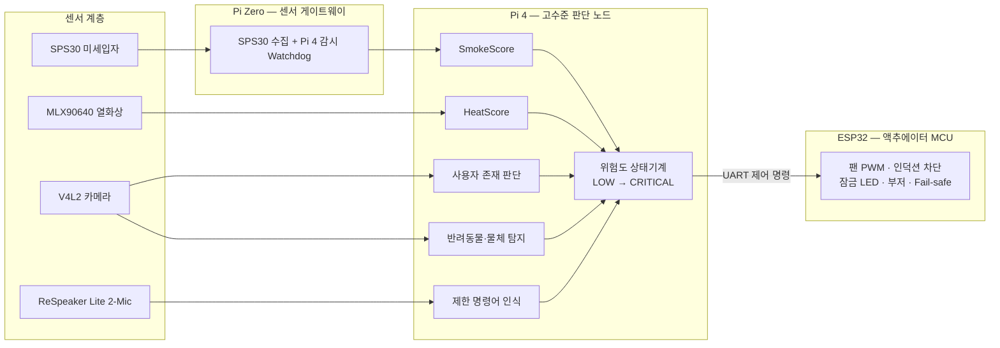

# HOOD&SEEK 🍳🔥

> **제24회 임베디드SW경진대회 — 스마트 가전 부문 | Team Ro92n**

인덕션과 후드를 독립 가전이 아닌 **하나의 협력형 주방 안전 시스템**으로 동작시키는 온디바이스 기반 스마트 키친 솔루션입니다.

- 조리 상태(연기, 화재 위험)와 사용자 부재를 감지하여 **후드 풍량 자동 조절** 및 **인덕션 전원 차단**
- 비조리 중 반려동물 등 물체 탐지 시 **인덕션 작동 자동 제한**
- 네트워크 없이 동작하는 **온디바이스(오프라인) 판단** 구조

## 시스템 개요



Pi 4의 **고수준 판단**과 ESP32의 **최종 동작 집행**을 분리하여, 판단 노드가 멈추더라도 ESP32와 Pi Zero가 fail-safe 상태로 전환하는 안전 제어 구조를 갖습니다.

## 핵심 기능

| 기능 | 설명 |
|---|---|
| 자동 후드 풍량 조절 | SPS30 PM 상승률·지속시간 기반 SmokeScore로 약풍/중풍/강풍 단계 제어 (이동평균 + 히스테리시스) |
| 부재 중 위험 대응 | 사용자 부재(AbsentConfirmed) + PM 상승/과열 감지 시 위험 단계 상승 → 후드 강풍, 인덕션 차단, 경고 |
| 비조리 중 접근 제한 | Idle 상태에서 반려동물·미확인 물체가 위험 구역 접근 시 인덕션 잠금 유지, ON/화력 증가 거부 |
| 제한 명령어 음성 제어 | "후드 강풍", "인덕션 꺼", "상태 알려줘" 등 웨이크워드 + 제한 명령어 (HIGH 이상에서는 안전 제어 우선) |

## 저장소 구조

```
HOOD-SEEK/
├── .github/            # 이슈·PR 템플릿, CI 워크플로 (docs/devops.md)
├── docs/               # 설계 문서 (아키텍처, 상태기계, 통신, HW, 테스트, 일정)
├── pi4/                # Raspberry Pi 4 — 고수준 판단 노드
│   ├── smoke/          #   SmokeScore 계산 (PM 상승률·이동평균·히스테리시스)
│   ├── thermal/        #   MLX90640 기반 HeatScore (최고온도·상승률·핫스폿 면적)
│   ├── vision/         #   사용자 존재 판단 + 반려동물·물체 ROI 탐지
│   ├── voice/          #   ReSpeaker 제한 명령어 인식 (Vosk / Whisper.cpp / KWS)
│   ├── fusion/         #   센서 융합 규칙 상태기계 (위험도 산출)
│   ├── comm/           #   Pi Zero·ESP32 통신 (UART 우선, heartbeat/timeout)
│   └── ui/             #   상태 표시·경고 UI, 로그 재생 뷰 (확장 Iteration)
├── pizero/             # Raspberry Pi Zero — 센서 게이트웨이
│   ├── sps30/          #   SPS30 PM 데이터 수집·로그화
│   └── watchdog/       #   Pi 4 동작 감시 및 fail-safe 트리거
├── esp32/              # ESP32 — 액추에이터 MCU (PlatformIO/Arduino)
│   ├── src/            #   팬 PWM, 인덕션 차단 시뮬레이션, LED, 부저, fail-safe
│   ├── include/
│   └── test/           #   펌웨어 단위 테스트 (PlatformIO)
├── shared/
│   └── protocol/       # 노드 간 UART 패킷 규격 단일 소스 (protocol.py + protocol.h)
├── config/             # 판단 임계값·제어 정책 (매월 측정 결과로 보정)
├── models/             # 경량 온디바이스 모델
│   ├── weights/        #   가중치 배치 위치 (릴리스로 배포, git 미커밋)
│   └── export_scripts/ #   ONNX/TFLite 변환·최적화 스크립트
├── scripts/            # 환경 설치·실행·배포 스크립트
└── tests/
    ├── unit/           #   pi4·pizero 모듈 단위 테스트
    └── integration/    #   TS-1 ~ TS-5 시나리오 테스트
```

## 문서

| 문서 | 내용 |
|---|---|
| [docs/architecture.md](docs/architecture.md) | 시스템 아키텍처 및 노드별 역할 |
| [docs/risk-state-machine.md](docs/risk-state-machine.md) | 위험 판단 상태기계와 단계별 제어 정책 |
| [docs/communication.md](docs/communication.md) | 디바이스 간 통신 프로토콜 (UART, heartbeat, fail-safe) |
| [docs/hardware.md](docs/hardware.md) | HW 구성, 배선, 배치 주의사항 |
| [docs/test-scenarios.md](docs/test-scenarios.md) | 5대 테스트 시나리오 및 평가지표 |
| [docs/roadmap.md](docs/roadmap.md) | 개발 일정 (2026.07 ~ 2026.10, MVP 1~6) |
| [docs/devops.md](docs/devops.md) | **팀원 협업 가이드(초심자용)**, CI 파이프라인, pre-commit, 브랜치 전략 |

## 팀 Ro92n

| 역할 | 이름 | 담당 |
|---|---|---|
| 팀장 | 남현지 | PM / 판단 융합·연기 스코어 (`fusion` `config` `smoke`) |
| 팀원 | 임재범 | AI·비전 (`vision` `thermal` `models`) / DevOps |
| 팀원 | 정정인 | 임베디드·통신 (`esp32` `pizero` `shared/protocol` `comm`) / Fail-safe |
| 팀원 | 이수현 | 경고 UX·UI (`pi4/ui`) / 데모 제작 |
| 팀원 | 김병직 | 측정·보정 데이터 수집 / HW 조립 / 시연 운영 |
