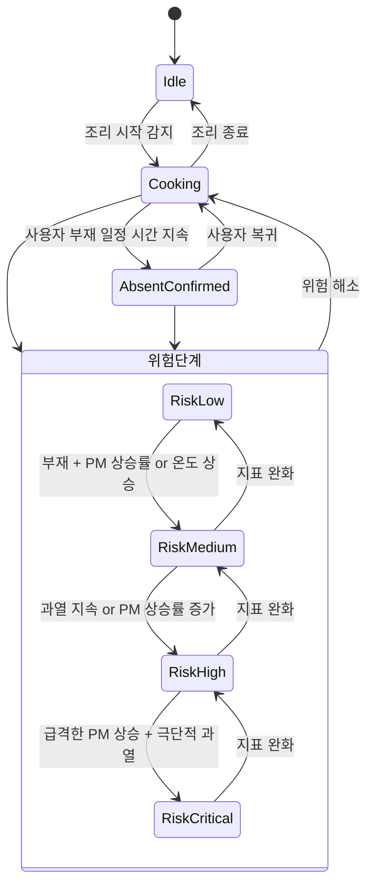

# 위험 판단 상태기계

판단 로직은 딥러닝 단독 판단이 아니라 **센서 융합 기반 규칙 상태기계**로 구현합니다. 프로토타입 단계에서 설명 가능성과 검증 가능성을 확보하기 위해 PM 변화량, 사용자 부재 여부, 열 위험 지표를 중심으로 위험도를 산출합니다.

## 입력 지표

| 지표 | 산출 위치 | 산출 방법 |
|---|---|---|
| **SmokeScore** | `pi4/smoke/` | PM 기준선 대비 상승률 + 지속 시간 + 이동평균. 순간 튐 방지를 위해 히스테리시스 적용 |
| **HeatScore** | `pi4/thermal/` | 조리면 최고온도 + 온도 상승률 + 핫스폿 면적 |
| **AbsentConfirmed** | `pi4/vision/` | 사용자 부재 상태가 일정 시간 이상 지속되는지 판단 |
| **접근 이벤트** | `pi4/vision/` | 위험 구역(인덕션 상판·조작부) ROI에 사용자 아닌 객체 진입 여부 |

## 상태 정의

주요 상태: `Idle`, `Cooking`, `AbsentConfirmed`, `RiskLow`, `RiskMedium`, `RiskHigh`, `RiskCritical`

위험도는 **연기 증가, 사용자 부재, 조리면 과열이 동시에 강해질수록** 상위 단계로 전이됩니다.

## 위험 단계별 제어 정책

| 단계 | 전이 조건 | 후드 | 인덕션 | 경고 |
|---|---|---|---|---|
| **LOW** | 정상 조리, SmokeScore에 따른 일반 변화 | 약풍/중풍/강풍 자동 조절 | 정상 동작 | — |
| **MEDIUM** | 사용자 부재 + PM 상승률 또는 온도 상승 감지 | 풍량 증대 | 출력 제한 검토 | 사용자 알림 |
| **HIGH** | 과열 지속 또는 PM 상승률 증가 | 강풍 | 출력 제한, ON/화력 증가 명령 거부 | 경고 (부저·LED) |
| **CRITICAL** | 급격한 PM 상승 + 극단적 과열 동시 발생 | 최대 풍량 | 차단 시뮬레이션 수행 | 부저 + LED + 알림 |

## 별도 안전 조건: 비조리 중 접근 잠금

위 위험 단계와 **독립적으로** 처리되는 안전 조건입니다.

- `Idle` 상태에서 사용자가 확인되지 않은 채 반려동물 또는 미확인 물체가 인덕션 위험 구역에 진입하면:
  - ESP32가 **인덕션 잠금 상태 유지**
  - 인덕션 **ON 명령 및 화력 증가 명령 거부**
- 목적: 고양이 등 반려동물이 조작부를 밟거나 물체가 조작부에 접촉하는 상황 예방

## 음성 명령과 안전 우선순위

- 인식 대상: "후드 강풍", "후드 약풍", "인덕션 꺼", "상태 알려줘" 등 **웨이크워드 + 제한 명령어** (자유 대화형 아님)
- 위험 단계가 **HIGH 이상**일 때는 "인덕션 켜", "화력 올려" 같은 명령을 내려도 **안전 제어가 우선**되어 명령을 거부한다.

## 히스테리시스 정책

PM 값이 일시적으로 튀는 경우(수증기, 기름 입자, 환기 영향) 즉시 풍량을 변경하지 않습니다.

- 이동평균으로 노이즈 평활화
- 단계 상승 임계값과 하강 임계값을 다르게 설정(히스테리시스)하여 풍량이 진동하지 않도록 함
- 임계값은 개발 일정의 매월 측정 결과를 기반으로 지속 보정 ([roadmap.md](roadmap.md) 참고)
